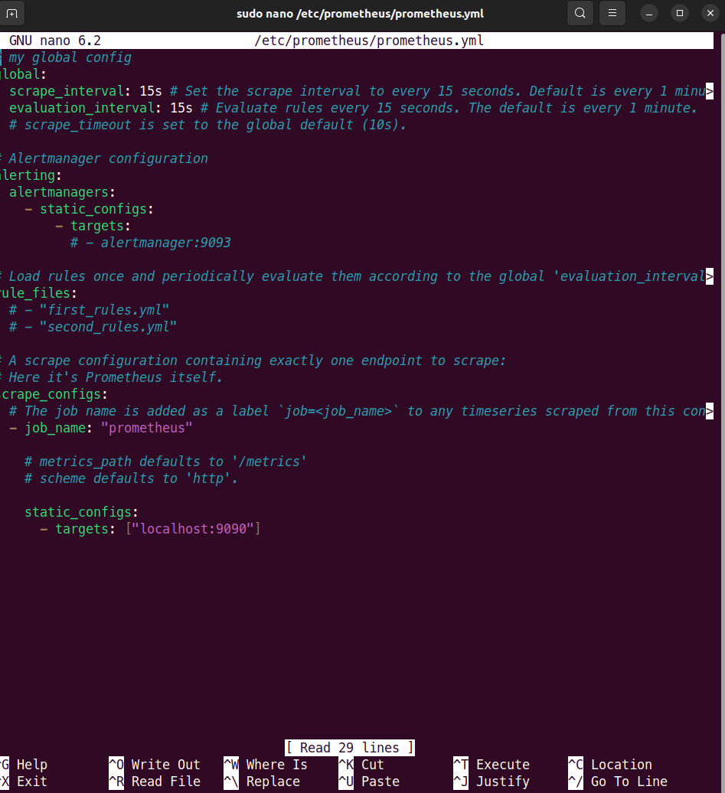
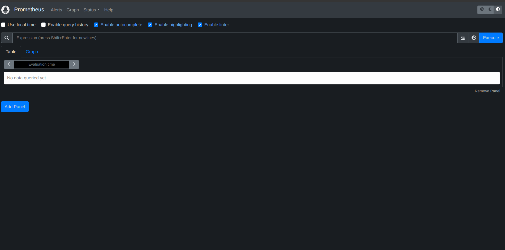

# Prometheus Task 1

## 1- What are the different HTTP status code and explain meaning of each of them?
- Informational: Server has received the request and is continuing to process it
- Successful: Request was successfully received, understood and accepted
- Redirection: Client must take additional action to complete the request
- Client Error: Request contains bad syntax or cannot be fulfilled
-----------------------------------------------
## 2- What database is used by Prometheus?
- TSDB (Time Series DataBase): Custom-built database that is optimized for storing and querying time-series data. It is designed to be highly scalable and performant, and it uses a compressed, in-memory format to store the time-series data
---------------------------------------
## 3- What is the differnece between different metrics types ( counter , gauge , histogram)?
- Counter: is a metric that represents a monotonically increasing value, used to track things like the number of requests received or the total number of errors that have occurred
- Gauge: is a metric that represents a value that can go up or down over time, used to track things like the amount of memory used or the number of active connections to a system
- Histogram: is a metric that represents the distribution of a set of values over time, used to track things like request latencies or response sizes
--------------------------------------------------------------
## 4- Install prometheus on your localhost or on server in any cloud provider:
### Prometheus running on port:9090:

------------------------------------
## Add any new target to prometheus.yaml file and apply any query on it using promql language:
### Add Node Exporter to prometheus.yml and running on port:9100:

